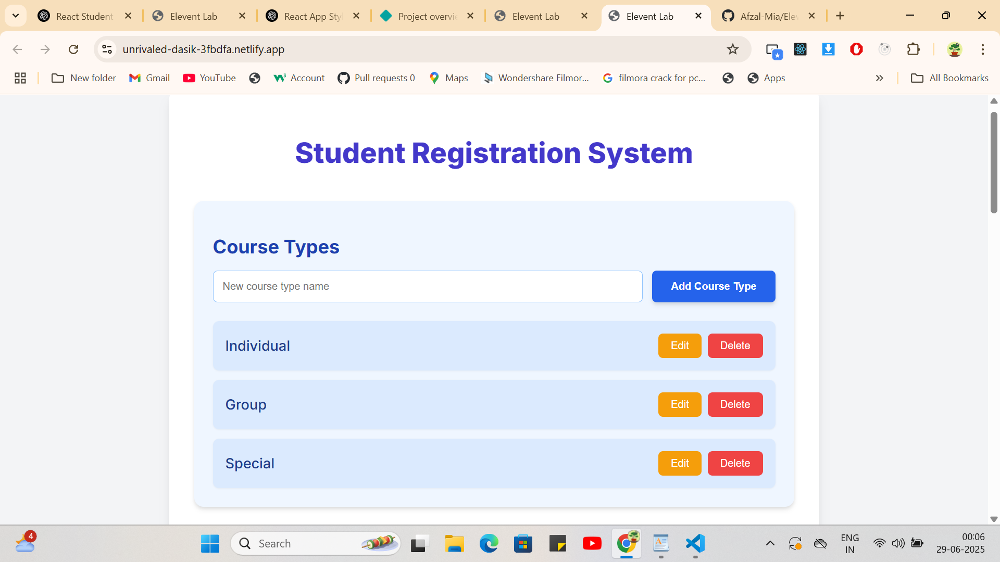
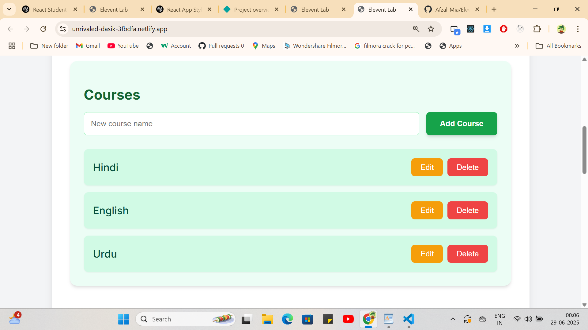
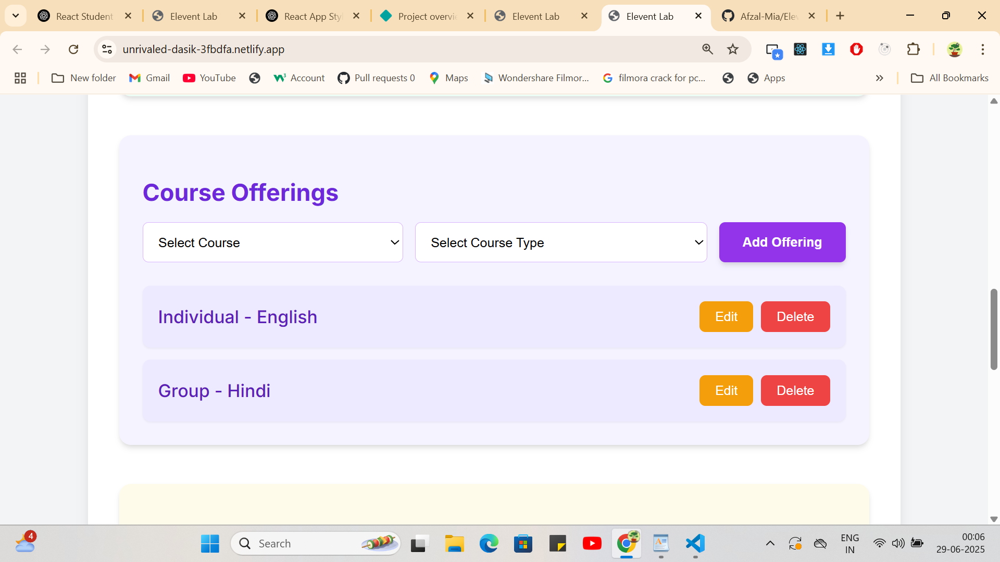
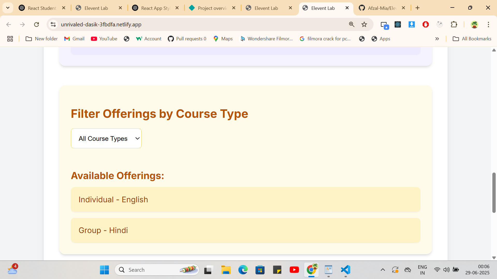
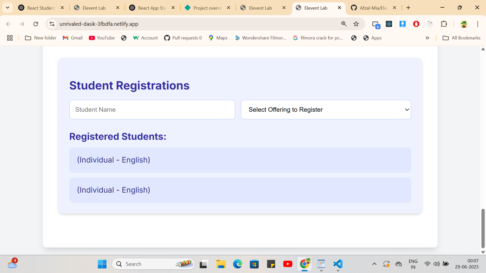

# 🎓 Student Registration System (React)

A fully functional and responsive **Student Registration System** built using **React only**. This application allows you to manage course types, courses, course offerings, and student registrations with real-time updates and filtering options.

---

## 📸 Preview







---

## 📚 Features

### 🔹 Course Types
- Add new course types (e.g., *Individual*, *Group*, *Special*)
- Edit existing course type names
- Delete course types
- List all course types

### 🔹 Courses
- Add new courses (e.g., *Hindi*, *English*, *Urdu*)
- Edit existing course names
- Delete courses
- List all courses

### 🔹 Course Offerings
- Create offerings by associating a **Course** with a **Course Type**
- View all course offerings (e.g., *Individual - English*)
- Update course-offering associations
- Delete course offerings
- Filter offerings by selected course type

### 🔹 Student Registrations
- Register students to available course offerings
- List all registered students for a specific offering
- Real-time input validation

---

## 💻 Tech Stack

- **Frontend**: React (Vite)
- **Styling**: Custom CSS inspired by TailwindCSS colors
- **State Management**: React `useState`, no external libraries
- **Deployment**: Netlify

---

## 🌐 Live Demo

👉 [View Live Project](https://unrivaled-dasik-3fbdfa.netlify.app/)

---

## 🚀 Getting Started

### 1. Clone the Repository

```bash
git clone https://github.com/your-username/student-registration-system.git
cd student-registration-system
